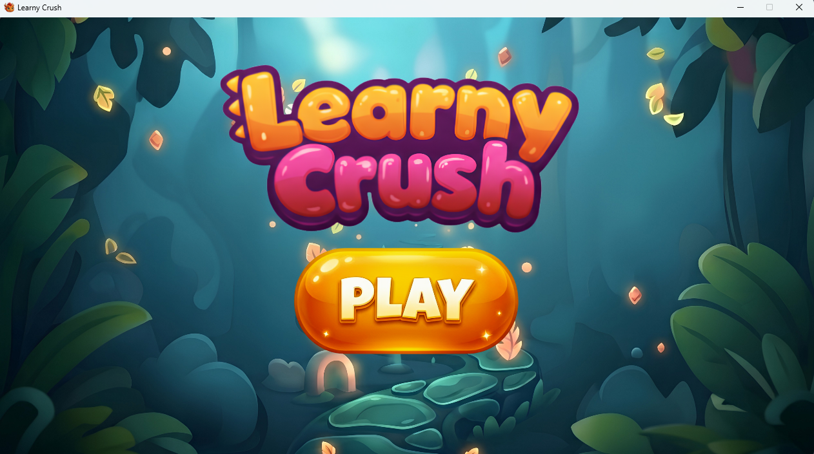
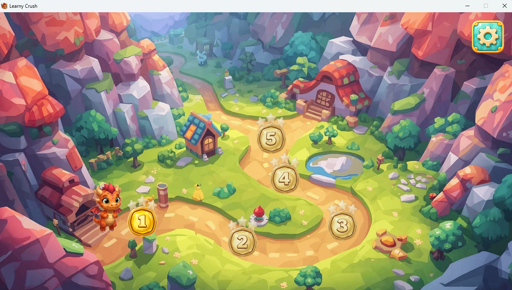
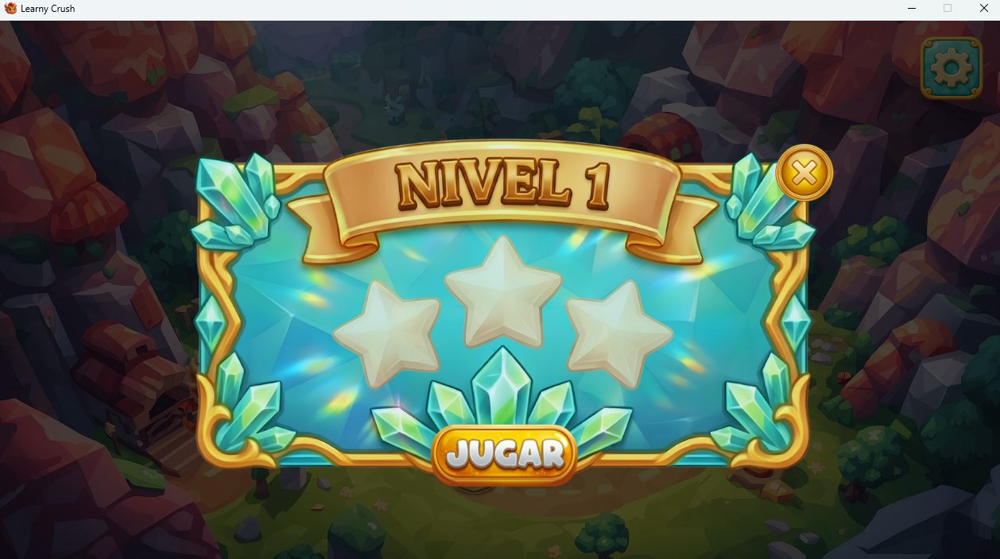
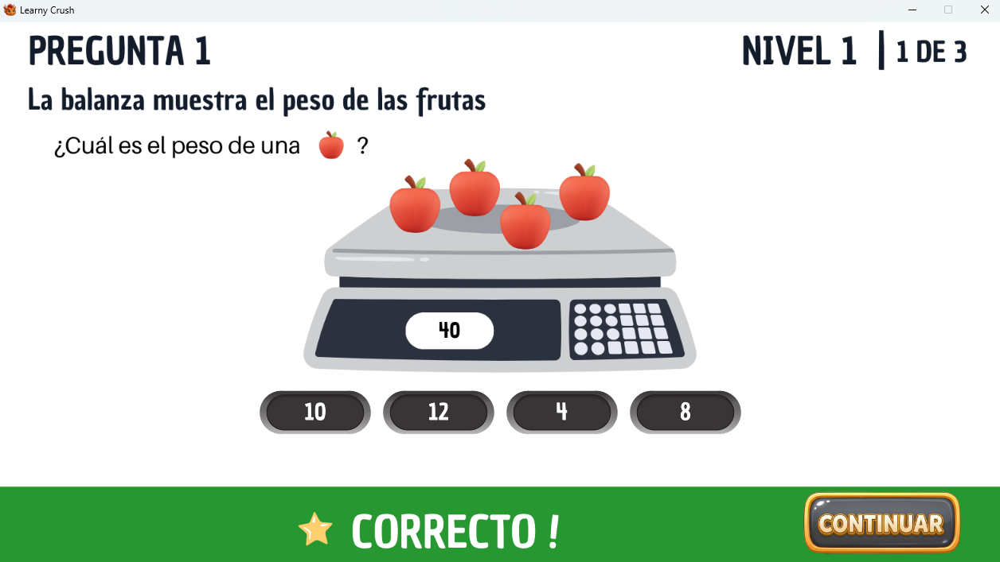
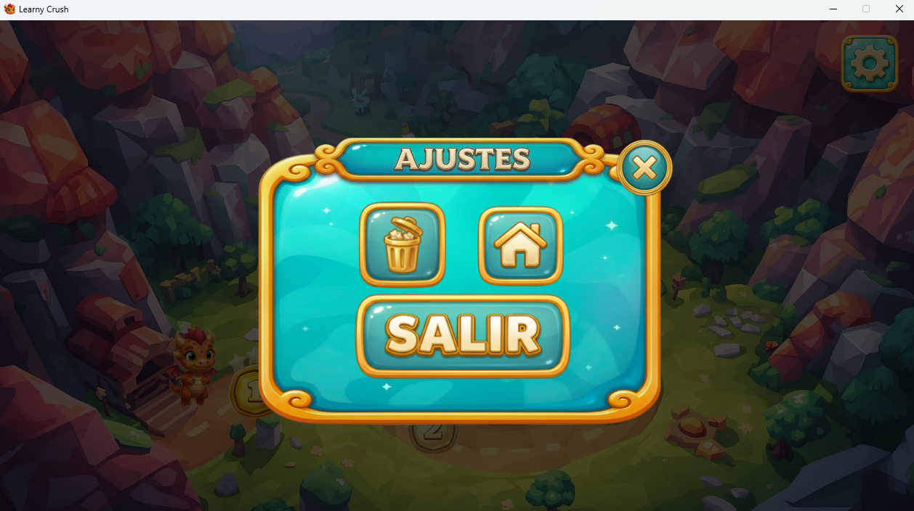

# Learny Crush

Learny Crush es un videojuego educativo desarrollado en JavaFX que combina aprendizaje y gamificación mediante un sistema de niveles progresivos.

El jugador avanza a través de diferentes niveles, responde preguntas educativas y obtiene estrellas según su desempeño. El progreso se almacena localmente utilizando SQLite.

## Tecnologías Utilizadas

* Java 21
* JavaFX 21
* Maven
* SQLite

## Requisitos

Antes de ejecutar el proyecto asegúrese de tener instalado:

* JDK 21 o superior
* Maven 3.9 o superior

Verificar instalación:

```bash
java --version
mvn --version
```

## Clonar el Proyecto

```bash
git clone https://github.com/Axllacosta/learnycrush-v1.git
```

Ingresar al directorio:

```bash
cd learnycrush-v1
```

## Ejecutar el Proyecto

Desde la terminal:

```bash
mvn clean install
mvn javafx:run
```

## Estructura del Proyecto

```text
src
└── main
    ├── java
    │   └── org.lc.v1
    │       ├── database
    │       ├── game
    │       │   ├── content
    │       │   ├── levels
    │       │   ├── modals
    │       │   └── player
    │       └── screens
    │
    └── resources
        └── images
```

## Funcionalidades

* Menú principal.
* Mapa de niveles.
* Sistema de progreso.
* Desbloqueo progresivo de niveles.
* Sistema de estrellas.
* Persistencia de datos mediante SQLite.
* Reinicio de progreso.
* Pantalla de créditos.

## Base de Datos

El proyecto utiliza SQLite.

La base de datos se genera automáticamente al iniciar la aplicación:

```text
learny_crush.db
```

No es necesario crear tablas manualmente.

## Autores

Proyecto académico desarrollado para el curso de Programación Orientada a Objetos.

Autores:

* Axel Acosta
* Cristian Osorio

## Capturas

### Menú Principal


### Mapa


### Nivel


### Juego


### Ajustes
